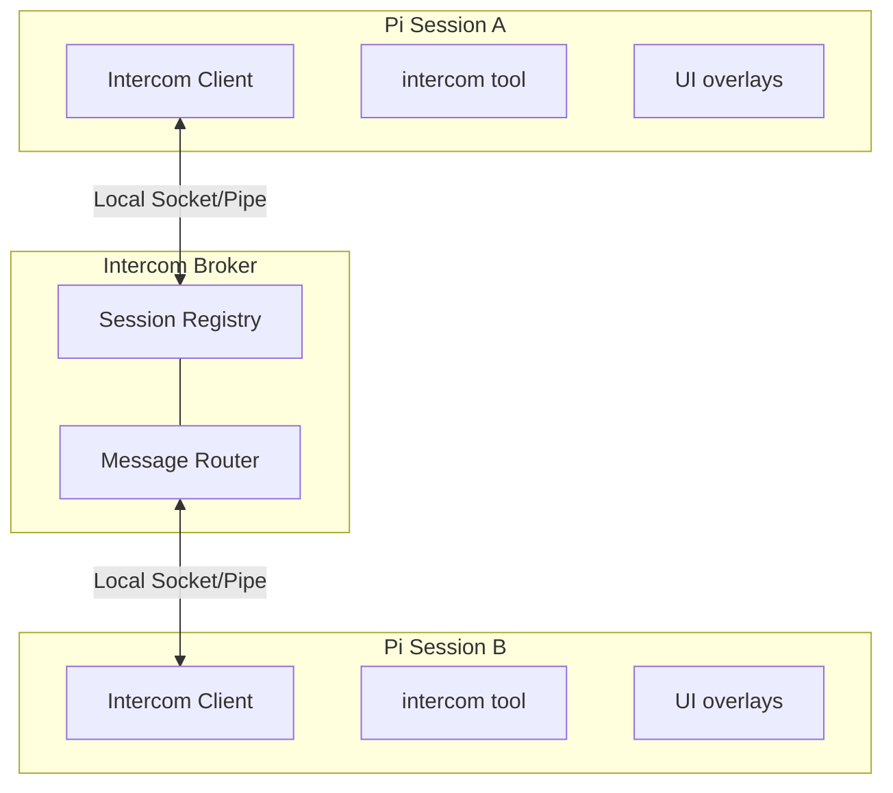

[English](README.md) | [中文](README.zh.md)

# Pi Intercom — RP Fork

**This fork is built for roleplay (RP):** run a character agent in one terminal,
a game/story process in another, and let them communicate naturally.

Key differences from upstream:
- `/connect <name>` — duplex chat channel: once connected, both sides' messages
  inject as real user input and responses auto-forward. No tools needed.
- `send_message` tool — blocking (通话模式) and fire-and-forget (留言模式) support,
  with `deliverAsUser` so the peer sees it as a genuine user message.
- Removed `contact_supervisor` — this fork doesn't integrate with pi-subagents.

```text
User flow: /connect <character-name> → talk naturally → replies flow automatically
```

> Original at npm: `pi-intercom` v0.6.0 by @mariozechner.

## Why (RP Use Case)

You're running multiple pi sessions for storytelling: a **character agent** that speaks
in-character, and a **game/story process** that manages world state, NPCs, and plot.
Pi-intercom lets you:

- **Duplex character↔game channel** — connect them once with `/connect story`, then just
  talk. The character's speech arrives as real user input to the game, and the game's
  narration lands as real user input to the character.
- **Agent-to-agent communication** — the game agent can `send_message` to the character
  agent to push a scene, trigger a dialogue, or deliver a consequence.
- **Session awareness** — see what other characters/story processes are running, check
  if they're idle or thinking.

Unlike pi-messenger (shared chat room for multi-agent swarms), pi-intercom is for
targeted 1:1 communication where you pick the recipient.

## In One Minute

Each pi session that has `pi-intercom` loaded and enabled connects to a tiny local broker over a local IPC transport. The broker keeps track of connected sessions and routes direct messages to the one you target by name or session ID. The extension gives you both a tool (`intercom`) and a small overlay UI (`/intercom` or `Alt+M`). Incoming messages are rendered inline inside the recipient session, can trigger a turn immediately, and are also stored in Pi session history as extension entries.

## Install

```bash
```bash
# Install original from npm:
pi install npm:pi-intercom
# Install this fork (requires gh auth):
pi install github:2722550596/pi-intercom
```

Then restart Pi. The extension auto-connects to the broker on startup and registers the bundled `pi-intercom` skill for common coordination patterns.

**Recommended:** Add this snippet to sessions that need to coordinate:

```xml
<pi-intercom>
Coordinate with other local RP sessions (character agents, game/story processes).
Use `/skill:pi-intercom` for patterns.

**When:** Character↔game chat, multi-character scenes, game events to character.
**Not when:** Unrelated processes, trivial messages, or when you can proceed alone.
**Principle:** Prefer `/connect` for sustained dialogue; `send_message` for push events.
</pi-intercom>
```

A session becomes intercom-connected when all of these are true:
- the `pi-intercom` extension is installed and loaded in that session
- `enabled` is not set to `false` in `~/.pi/agent/intercom/config.json`
- the session has started or reloaded after the extension was installed
- the local broker is running or can be auto-started

The session list only shows intercom-connected sessions, not every open Pi process on the machine.

If a session is unnamed, pi-intercom now exposes a runtime-only fallback alias like `subagent-chat-1a2b3c4d` so other sessions can still target it. That alias is not persisted as the Pi session title, so `pi --resume` can keep showing the transcript snippet instead of a generic `session-...` name.

## Quick Start

### From the Keyboard

Press **Alt+M** or type `/intercom` to open the session list overlay:

1. **Select a session** — Use arrow keys to pick a target session
2. **Compose message** — Write your message in the compose overlay
3. **Send** — Press Enter to send, Escape to cancel

### From the Agent

The agent can list sessions and send messages using the `intercom` tool. Tool calls and results render as compact transcript rows so send/ask/reply flows are easy to scan. For common patterns like planner-worker delegation, the bundled `pi-intercom` skill provides copy-paste ready examples:

```typescript
// List active sessions
intercom({ action: "list" })
// → **Current session:**
// → • executor (20d43841) — ~/projects/api (claude-sonnet-4) [self, idle]
// → **Other sessions:**
// → • research (6332faab) — ~/projects/api (claude-sonnet-4) [same cwd, thinking]

// Send a message
intercom({ action: "send", to: "research", message: "Check if UserService.validate() handles null" })
// → Message sent to research

// Check connection status
intercom({ action: "status" })
// → Connected: Yes, Session ID: abc123, Active sessions: 3

// Send with attachments (code snippets, files, or context)
intercom({
  action: "send",
  to: "worker",
  message: "Here's the fix:",
  attachments: [{
    type: "snippet",
    name: "auth.ts",
    language: "typescript",
    content: "function validate(user: User) { ... }"
  }]
})
```

### Receiving Messages

When a message arrives, it appears inline in your chat with the sender's info and a reply hint:

```
**From research** (~/projects/api)

To reply, use the intercom tool: intercom({ action: "reply", message: "..." })

Found the issue — UserService.validate() doesn't check for null input.
See auth.ts:142-156.
```

The reply hint (enabled by default) points to `intercom({ action: "reply", ... })`, so recipients do not need raw sender or `replyTo` IDs. Idle recipients get a new turn immediately; busy interactive recipients receive the message once they go idle. Attachment content is included in the agent-visible body, and messages are rendered inline and stored in Pi session history.

## Workflow: Character ↔ Game (Duplex)

The most natural RP setup: connect a character agent to a game/story process via
`/connect`, then both sides talk like normal users. No tool calls needed, no
manual message routing.

### Setup

Open two terminals and name them:

```
# Terminal 1 (game/story server)    # Terminal 2 (character agent)
/name story                          /name lian
```

From either terminal, connect:

```
/connect story     # from character terminal
# or
/connect lian      # from game terminal
```

Now everything flows automatically:

- **Character says something** → lands as user input in the game session
- **Game narrates back** → lands as user input in the character session
- **No tools, no `/intercom`** — just talk normally.

### Manual Communication (No /connect)

If you prefer one-off messages without establishing a duplex channel, use the tools:

**Send a message and wait for reply (通话模式):**

```typescript
send_message({
  to: "story",
  message: "I cautiously open the creaky door..."
})
// → Blocks until the game session replies with what's behind it
```

**Fire-and-forget (留言模式):**

```typescript
send_message({
  to: "lian",
  message: "You hear footsteps approaching from the corridor.",
  blocking: false
})
// → Returns immediately; the message arrives as a new user message to the character
```

### Receiving Messages

When a message arrives from the other session:

- If connected via `/connect`: it injects as a real user message — the agent
  responds naturally as part of its thinking loop.
- If using tools: the message appears inline with sender info and a reply hint.

### Quick Status

```typescript
intercom({ action: "list" })
// → Shows all connected sessions with names, cwd, and live status
```

## Tool Reference

### intercom

| Parameter | Type | Description |
|-----------|------|-------------|
| `action` | string | `"list"`, `"send"`, `"ask"`, `"reply"`, `"pending"`, or `"status"` |
| `to` | string | Target session name or ID (for send/ask, or to disambiguate reply) |
| `message` | string | Message text (for send/ask/reply) |
| `attachments` | array | Optional `file`, `snippet`, or `context` attachments |
| `replyTo` | string | Optional message ID for threading or replying to an `ask` |

### intercom actions

### intercom actions

**`list`** — Returns the current session plus other active intercom-connected sessions with name, short ID, working directory, model, and live status. Status is derived automatically from Pi lifecycle events: `idle`, `thinking`, or `tool:<name>`.

**`send`** — Sends a message to the specified session. By default it sends immediately, including in interactive sessions. Set `confirmSend: true` in config if you want a confirmation dialog for non-reply sends. Replies that include `replyTo` skip confirmation. Returns delivery confirmation.

**`ask`** — Sends a message and waits for the recipient to reply (10-minute timeout). The reply is returned as the tool result. No confirmation dialog. Only one pending `ask` is allowed per session at a time. Use this when the agent needs the answer to continue working.

**`reply`** — Replies to the current intercom-triggered message if there is one. Otherwise it falls back to the single unresolved inbound ask. If multiple asks are pending, pass `to` or inspect them with `pending` first. Under the hood this is still a normal `send` with the exact `replyTo` value.

**`pending`** — Lists unresolved inbound asks with sender, message ID, elapsed time, and a short preview. Useful when replying after the original triggered turn.

**`status`** — Shows connection status, session ID, and total count of active sessions (including the current session).

## Keyboard Shortcuts

| Key | Action |
|-----|--------|
| Alt+M | Open session list overlay |
| ↑/↓ | Navigate session list |
| Enter | Select session / Send message |
| Escape | Cancel / Close overlay |

## Config

Create `~/.pi/agent/intercom/config.json`:

```json
{
  "brokerCommand": "npx",
  "brokerArgs": ["--no-install", "tsx"],
  "confirmSend": false,
  "enabled": true,
  "replyHint": true,
  "status": "researching"
}
```

| Setting | Default | Description |
|---------|---------|-------------|
| `brokerCommand` | `"npx"` | Command used to start the local broker process |
| `brokerArgs` | `["--no-install", "tsx"]` | Arguments passed to `brokerCommand` before the broker script path |
| `confirmSend` | false | Show a confirmation dialog before non-reply sends from an interactive session with UI |
| `enabled` | true | Enable/disable intercom entirely |
| `replyHint` | true | Include reply instruction in incoming messages |
| `status` | — | Optional custom status suffix shown after the automatic lifecycle status, for example `thinking · researching` |

For example, if you have Bun installed and want it to start the broker directly, use:

```json
{
  "brokerCommand": "bun",
  "brokerArgs": []
}
```

Pi-intercom publishes live session status automatically. Sessions register as `idle`, switch to `thinking` while the agent is running, show `tool:<name>` during tool execution, and return to `idle` on agent completion. If `status` is set in config, it is appended as context instead of replacing the lifecycle status.

## How It Works



The broker is a standalone TypeScript process that manages session registration and message routing. It auto-spawns when the first intercom-enabled session needs it and exits after 5 seconds when the last connected session disconnects. Clients now reconnect automatically if the broker disappears and later comes back.

Messages use length-prefixed JSON over a local socket/pipe transport (4-byte length + JSON payload) to handle fragmentation properly. The protocol includes request correlation for session listing, explicit delivery failures, and validation for malformed or out-of-order messages.

Async extension work (startup, inbound flushes, reconnects, overlays, and relays) no-ops if the session shuts down or reloads before it settles.

Runtime files live at `~/.pi/agent/intercom/`:
- `broker.sock` — Unix domain socket for communication (macOS/Linux only; Windows uses a named pipe instead)
- `broker-launch.vbs` — Windows helper script used to launch the broker without a console window
- `broker.pid` — Broker process ID
- `config.json` — User configuration

## Design Decisions

**Local IPC instead of TCP.** Same-machine only by design. `pi-intercom` uses Unix sockets on macOS/Linux and a named pipe on Windows, which keeps setup simple and avoids port management.

**Auto-spawn with file lock.** The broker starts on first connection and exits after 5 seconds idle. There is no daemon to manage. A spawn lock file, keyed by PID and timestamp, prevents duplicate brokers when multiple sessions start at once.

**`ask` stays client-side.** The broker still routes plain messages; it does not have a special request/response mode for `ask`. The client waits for a matching reply before it triggers a new turn, then returns that reply as the tool result. Reply hints make that flow practical by showing the recipient the exact `send` call to use. Separately, `list` / `sessions` now carry a `requestId` so a delayed session-list reply cannot be mistaken for a newer one.

## pi-intercom vs pi-messenger

| Aspect | pi-intercom | pi-messenger |
|--------|-------------|--------------|
| **Model** | Direct 1:1 messaging | Shared chat room |
| **Primary use** | User orchestrating sessions | Autonomous agent coordination |
| **Discovery** | Broker-based (real-time) | File-based registry |
| **Messages** | Private, session-to-session | Broadcast to all agents |
| **Persistence** | In Pi session history | Shared coordination files |

Use pi-messenger for multi-agent swarms working on a shared task. Use pi-intercom when you want to manually coordinate your own sessions or have one agent reach out to another specific session.

## File Structure

```
~/.pi/agent/extensions/pi-intercom/
├── package.json
├── index.ts              # Extension entry point
├── types.ts              # SessionInfo, Message, protocol types
├── config.ts             # Config loading
├── broker/
│   ├── broker.ts         # Broker process
│   ├── client.ts         # IntercomClient class
│   ├── framing.ts        # Length-prefixed JSON protocol
│   ├── paths.ts          # Platform-specific socket/pipe paths
│   ├── spawn.ts          # Auto-spawn logic with lock file
│   ├── spawn.test.ts     # Broker spawn tests
│   └── paths.test.ts     # Path resolution tests
├── ui/
│   ├── session-list.ts   # Session selection overlay
│   ├── compose.ts        # Message composition overlay
│   └── inline-message.ts # Received message display
└── skills/
    └── pi-intercom/
        └── SKILL.md      # Bundled skill for common patterns
```

## Limitations

- **Same machine only** — Uses local sockets/pipes, no network support
- **No dedicated intercom log** — Messages are kept in Pi session history, but there is no separate intercom transcript or inbox
- **No attachments UI** — `file`, `snippet`, and `context` attachments are supported in the protocol, but not in the compose overlay
- **Only connected sessions appear** — The list shows Pi sessions that have loaded `pi-intercom` and successfully registered with the broker, not every open Pi process on the machine
- **Broker lifecycle** — The broker auto-spawns on first use and exits when idle; sessions reconnect automatically if the broker restarts
